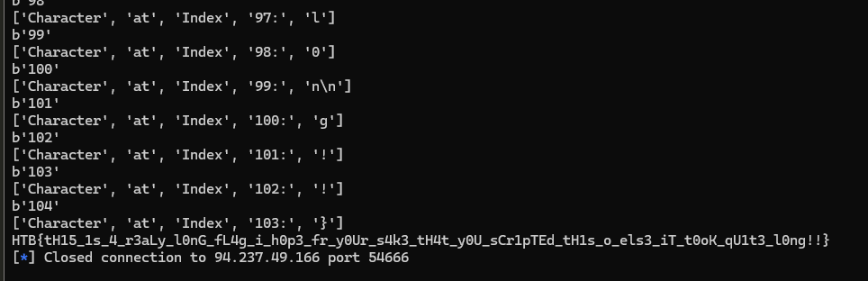

# 1. Character

## Decription


## Solve Problem

### 1. Openning Connection


### 2. Solution

```
import pwn
import time
s = pwn.connect('94.237.49.166',54666)

info = s.recv(1024)
print(info)

flag = ""
dk = 23
for i in range(0,110):
	try:
		print(f'{i}'.encode('ascii'))
		s.sendline(f'{i}'.encode('ascii'))
		if(i in [10,100]):
			dk+=1
		info = s.recv(dk)
		info2 = info.decode().split(' ')
		print(info2)
		if(len(info2)==5):
			flag+=info2[4].strip('\n')
		s.recv(1024)
	except:
		pass
	if('}' in flag):
		break
print(flag)
s.close()
#HTB{tH15_1s_4_r3aLly_l0nG_fL4g_i_h0p3_f0r_y0Ur_s4k3_tH4t_y0U_sCr1pTEd_tH1s_oR_els3_iT_t0oK_qU1t3_l0ng!!}
```



# We have the flag: HTB{tH15_1s_4_r3aLy_l0nG_fL4g_i_h0p3_fr_y0Ur_s4k3_tH4t_y0U_sCr1pTEd_tH1s_o_els3_iT_t0oK_qU1t3_l0ng!!}
