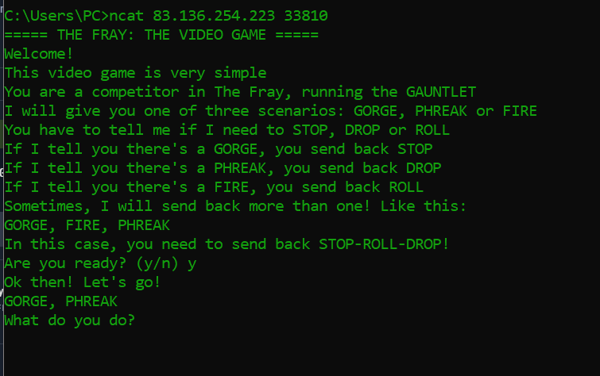
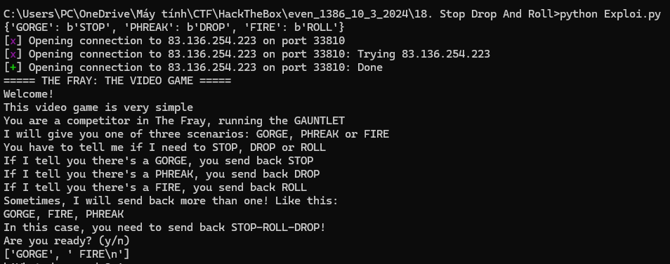

# 2. Stop Drop and Roll

## Decription


## Solve Problem

### 1. Openning Connection




### 2. Solution

```
from pwn import *


exploit_flag = {"GORGE":b"STOP", "PHREAK":b"DROP" , "FIRE":b"ROLL"}


def exploit_string(info):
	ex = b""
	for i in info:
		ex+=b'-'+exploit_flag[i.strip(' \n')]
	return ex.strip(b'-')+b'\n'


print(exploit_flag)
s = connect('83.136.254.223',33810)
print(s.recv(1024).decode())

s.send(b'y')
s.send(b'\n')

#eploit
s.recvuntil(b"Let's go!\n").decode()
dem = 1
while dem<10000:
	info = s.recvuntil(b"\n").decode().split(',')
	if("HTB" in info):
		print(info)
		break
	print(info)
	print(s.recv())

	exploit_f = exploit_string(info)
	print(exploit_f)
	s.send(exploit_f)
	#print(s.recv())
	dem+=1


s.close()
```




# We have the flag: HTB{1_wiLl_sT0p_dR0p_4nD_r0Ll_mY_w4Y_oUt!}
