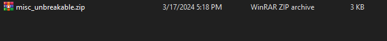
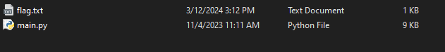
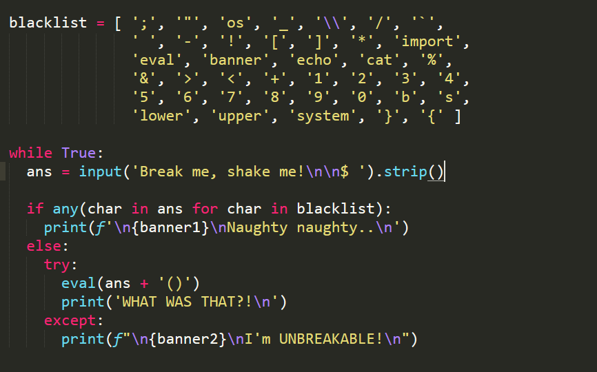
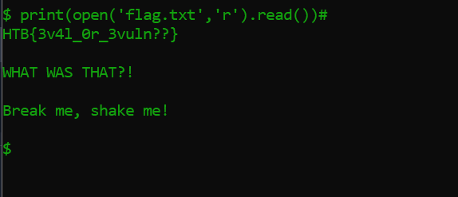

# 3. Unbreakable

## Decription

## Solve Problem

### 1. Extracting the file

I have the "script.sh" file

### 2. I open the file to see the content of file:

### 3. Shell Exploit

print(open('flag.txt','r').read())#

# We have the flag: HTB{3v4l_0r_3vuln??}
