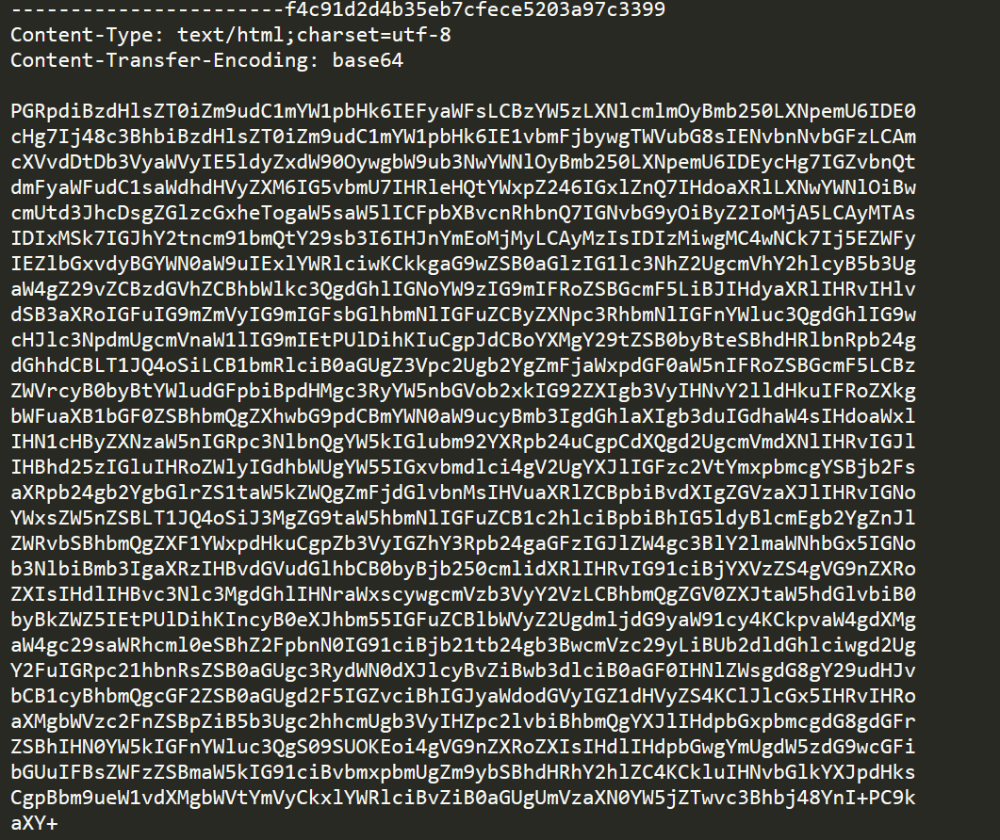

# 1. Urgent

## Decription

## Solve Problem

### 1. Extracting the file

I have the "Urgent Faction Recruitment Opportunity - Join Forces Against KORP™ Tyranny.eml" file

### 2. I open the file to see the content of file:

### 3. I see the decode base-64 content, I decode it.

### 4. I run this code in the console of browser:

# We have the flag: HTB{4n0th3r_d4y_4n0th3r_ph1shi1ng_4tt3mpT}
