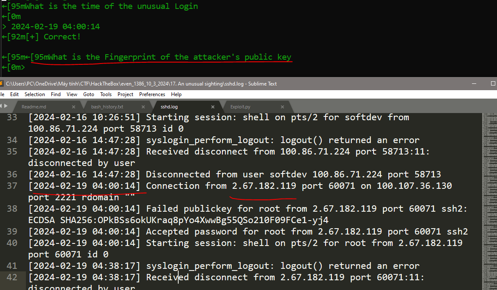

# 2.  An unusual sighting

## Decription

## Solve Problem

### 1. Extracting the file

I have the "script.sh" file

### 2. I open the file to see the content of file:

### 3. Running "Spawn Docker" and then answering the question based on the content of file:

We Have The Flag: HTB{B3sT_0f_luck_1n_th3_Fr4y!!}