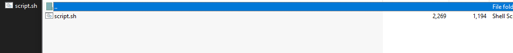

# 3. It has begun

## Decription

## Solve Problem

### 1. Extracting the file

I have the "script.sh" file

### 2. I open the file to see the content of file:

### 3. I see the two string.

### 4. I decode it.

I reverse the string:

I use base64 decode:

# We have the flag: HTB{w1ll_y0u_St4nd_y0uR_Gr0uNd!!}
