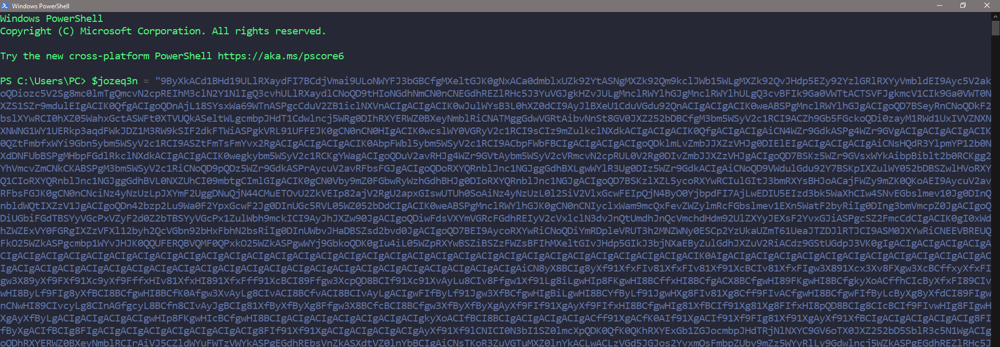
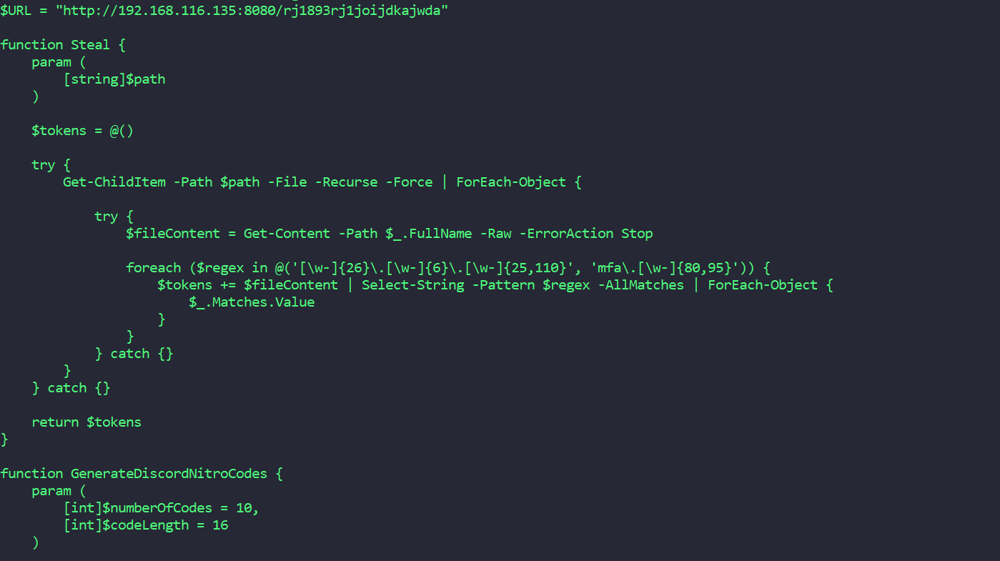

# 1. Fake Boost

## Decription

## Solve Problem

### 1. Extracting the file:

I have the "capture.pcapng" file

### 2. I open the file to see the content of file:

### 3. Extract the content of file:

### 4. Open the "freediscordnitro" to see the content

### 5. Decode the content from the code written in file:

### 6. From the script, I write the script which decode the information in file:

#### Another Information is encoded:

#### the script has:

#### I write the script to decode:

# We have the flag: HTB{fr33_N17r0G3n_3xp053d!_b3W4r3_0f_T00_g00d_2_b3_7ru3_0ff3r5}
