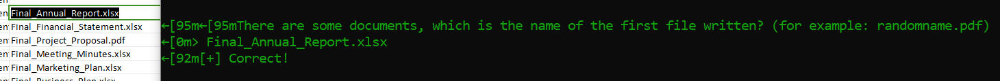
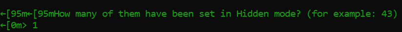

# 1. Pursue The Tracks

## Decription

## Solve Problem

### 1. Extracting the file

I have the "z.mft" file

### 2. I find the writeup which having the same process to see the content in mft file.

https://github.com/th3c0rt3x/CyberTalents/blob/main/%5BMEDIUM%5D%20MFT.md

### 3. Use the tool to extract information:

### 4. Extract the Information

### 5. See the content

### 6. Answer the question to take flag:

# We have the flag: HTB{p4rs1ng_mft_1s_v3ry_1mp0rt4nt_s0m3t1m3s}
