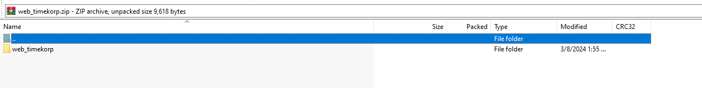
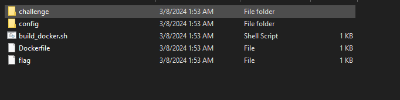
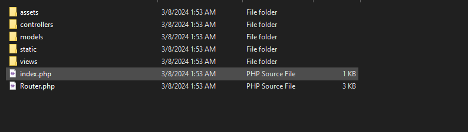
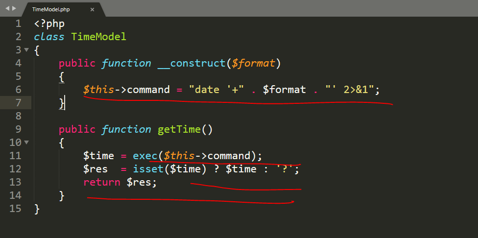
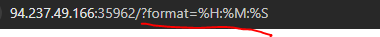
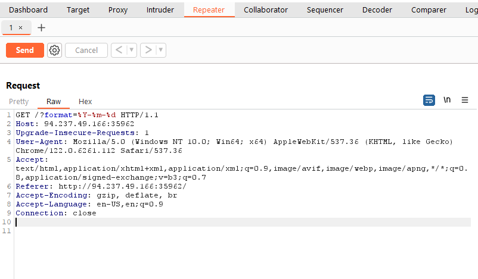
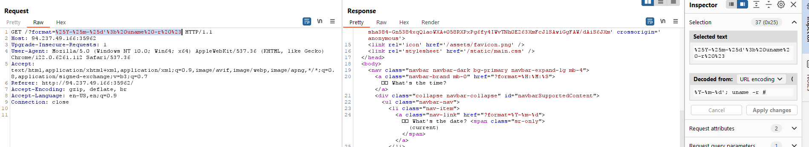
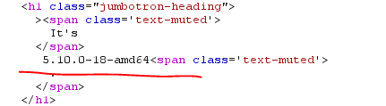
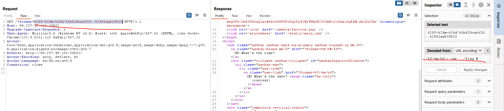
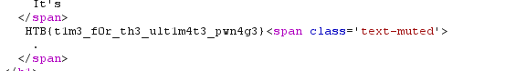

# 1. Urgent

## Decription

## Solve Problem

### 1. Extracting the file

I see many file.

### 2. I open the file to see the content of file:

### 3. I open the file TimeModel.php.

=> OS command injection

### 4. I use burp to extract information by command injection  '; uname -r #  :

# We have the flag: HTB{t1m3_f0r_th3_ult1m4t3_pwn4g3}
