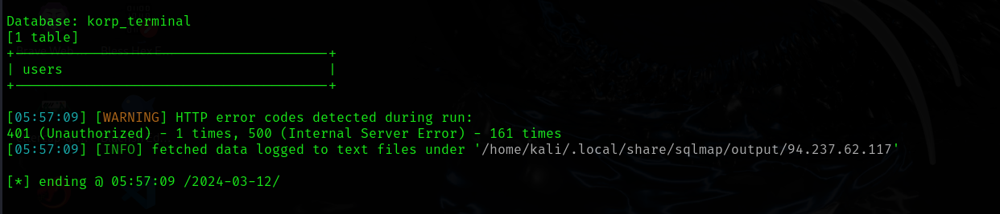
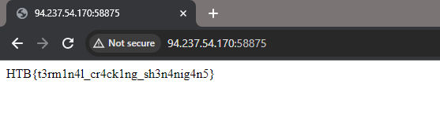

# 2. KORP Terminal

## Decription

## Solve Problem

### 1. Open the browser

### 2. I open write some information to test:

In this challenge, I use the two tools: sqlmap and hashcat
I'm sorry for that, but I find the vul by hand but I cann't by pass, so I use the sqlmap tool to extract secret

### 3. I use the tool :

username: admin
password: password123

# We have the flag: HTB{t3rm1n4l_cr4ck1ng_sh3n4nig4n5}
