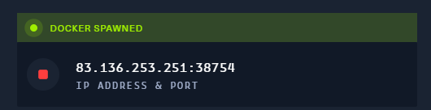
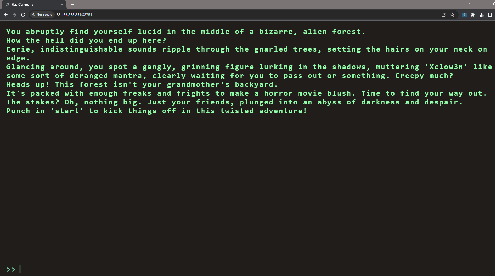
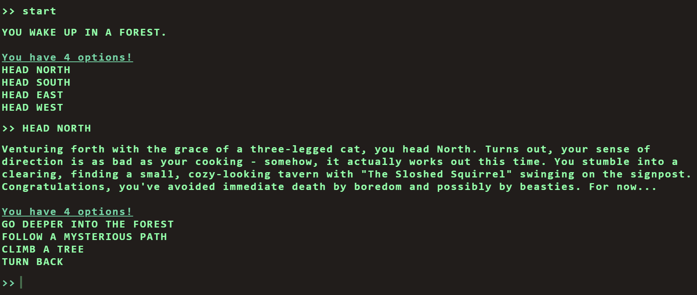
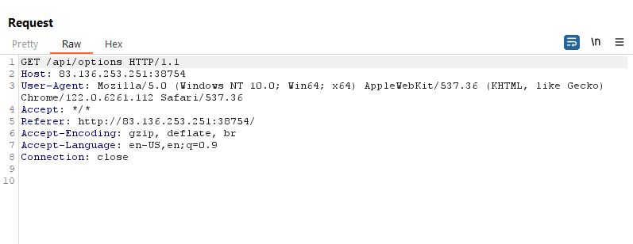
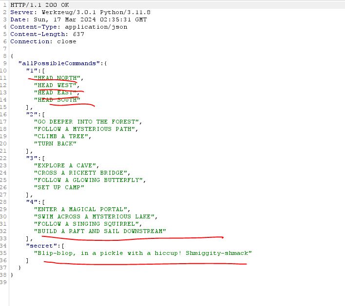
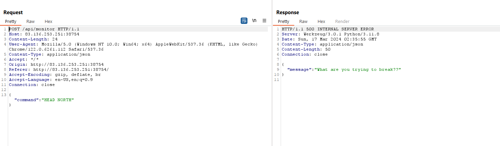
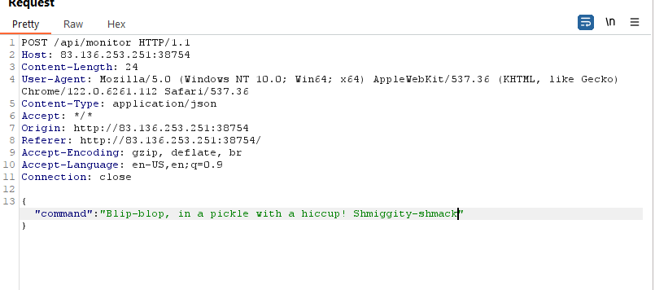
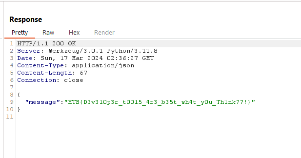

# 3. Flag Command

## Decription

## Solve Problem

### 1. Open the browser

### 2. I open write some information to test:

### 3. I use burp to test, I see the API :

# We have the flag: HTB{D3v3l0p3r_t00l5_4r3_b35t_wh4t_y0u_Th1nk??!}
