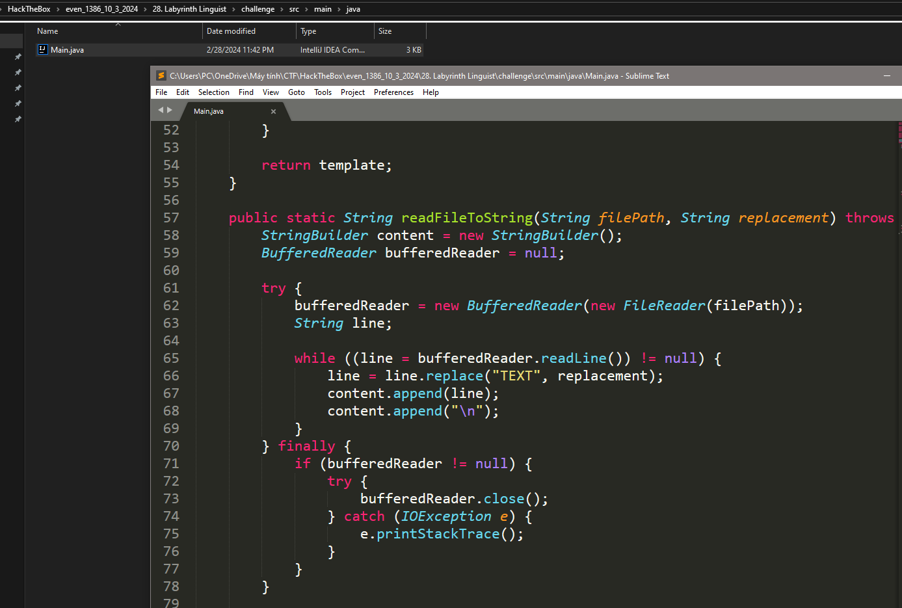

# 3. Flag Command

## Decription

## Solve Problem

### 1. Open the browser

### 2. I open write some information to test:

### 3. I use burp to test, I see the Java Templage Injection :

https://gosecure.github.io/template-injection-workshop/#6

# We have the flag: HTB{f13ry_t3mpl4t35_fr0m_th3_d3pth5!!}
