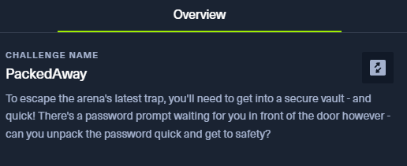
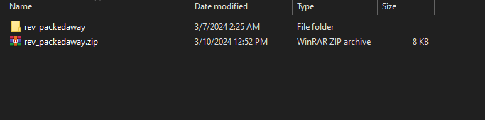
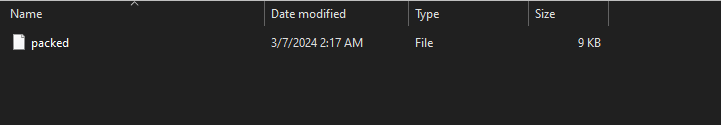
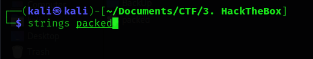
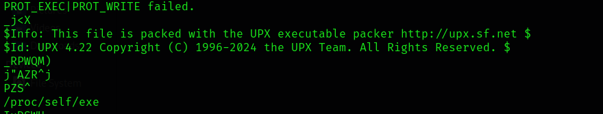
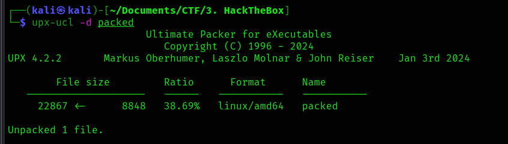
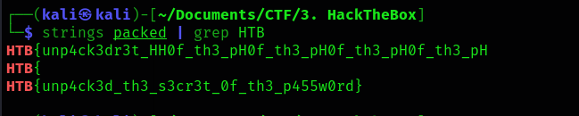

# 2. PackedAway

## Decription

## Solve Problem

### 1. Extracting the file

I see the file.

### 2. I use string command in linux to see the comment:

### 3. After reading the information, I understand the file is packed. So I must unpack it:

### 4. I use the string command againt.

# We have the flag: HTB{unp4ck3d_th3_s3cr3t_0f_th3_p455w0rd}

