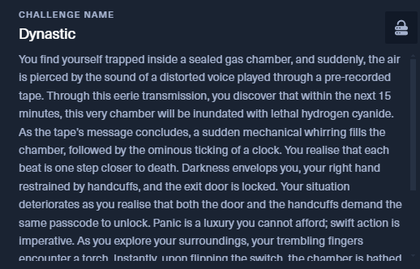
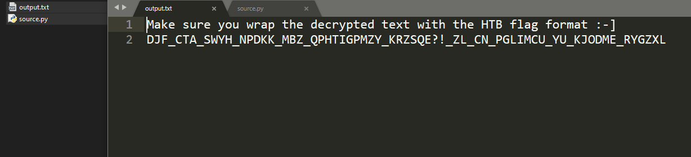
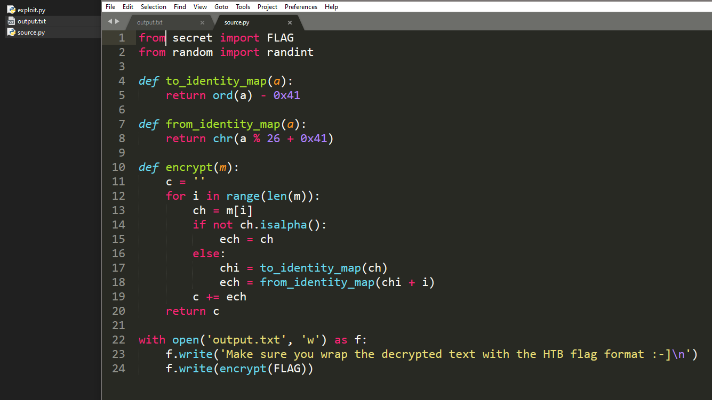
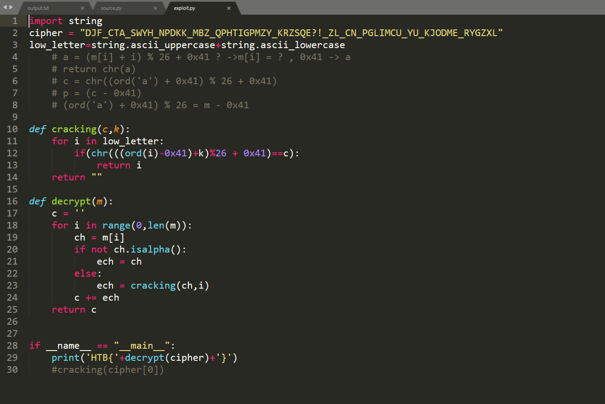

# 1. Dynastic

## Decription



## Solve Problem

### 1. Extracting the file


I see the file.

### 2. Open the file:





### 3. Exploit



```
import string
cipher = "DJF_CTA_SWYH_NPDKK_MBZ_QPHTIGPMZY_KRZSQE?!_ZL_CN_PGLIMCU_YU_KJODME_RYGZXL"
low_letter=string.ascii_uppercase+string.ascii_lowercase
    # a = (m[i] + i) % 26 + 0x41 ? ->m[i] = ? , 0x41 -> a
    # return chr(a)
    # c = chr((ord('a') + 0x41) % 26 + 0x41)
    # p = (c - 0x41)
    # (ord('a') + 0x41) % 26 = m - 0x41

def cracking(c,k):
	for i in low_letter:
		if(chr(((ord(i)-0x41)+k)%26 + 0x41)==c):
			return i
	return ""

def decrypt(m):
    c = ''
    for i in range(0,len(m)):
        ch = m[i]
        if not ch.isalpha():
            ech = ch
        else:
           	ech = cracking(ch,i)
        c += ech
    return c


if __name__ == "__main__":
	print('HTB{'+decrypt(cipher)+'}')
	#cracking(cipher[0])
```

# We have the flag: HTB{DID_YOU_KNOW_ABOUT_THE_TRITHEMIUS_CIPHER?!_IT_IS_SIMILAR_TO_CAESAR_CIPHER}
