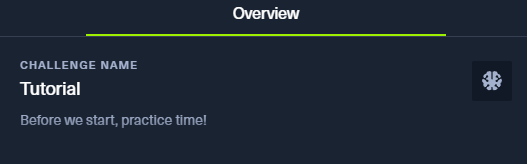
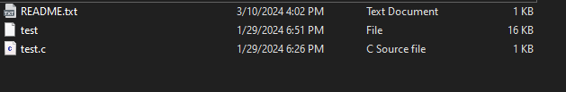
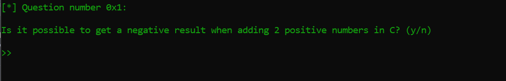

# 1. LootStash

## Decription

## Solve Problem

### 1. Extracting the file

I see the file.

### 2. I use the Ghidra tool to see comment in file:

# We have the flag: HTB{n33dl3_1n_a_l00t_stack}
