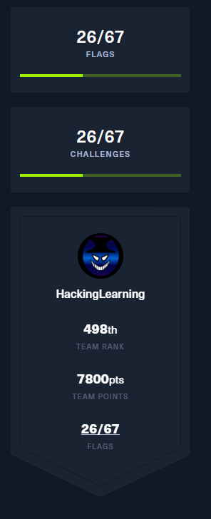
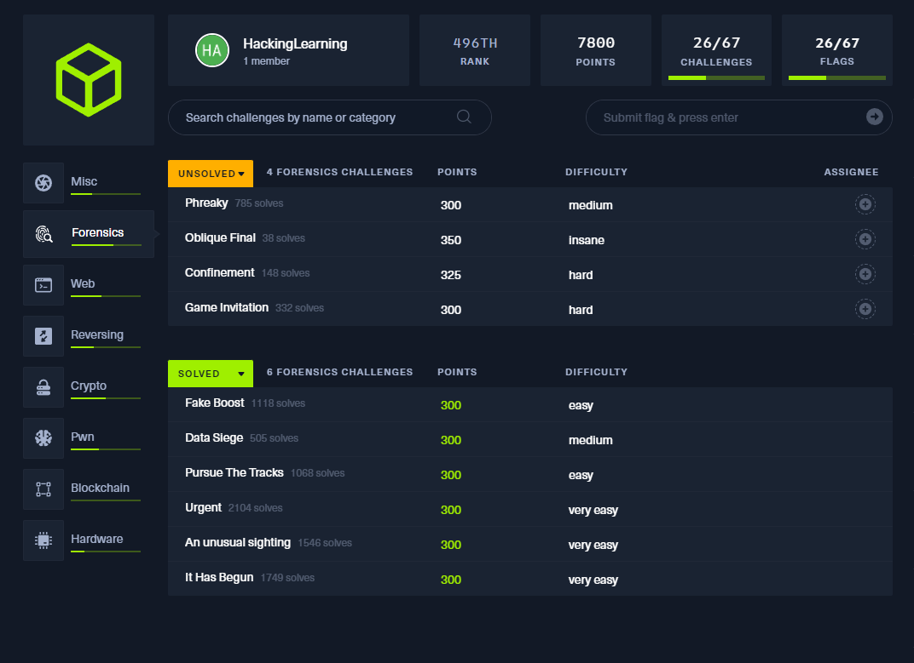
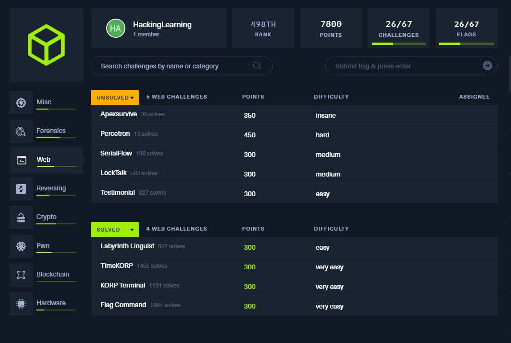
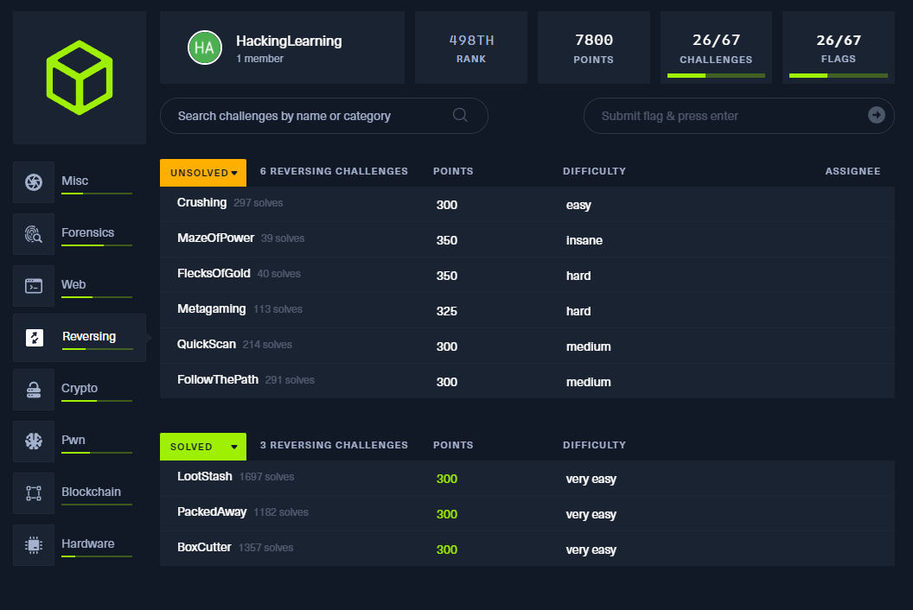
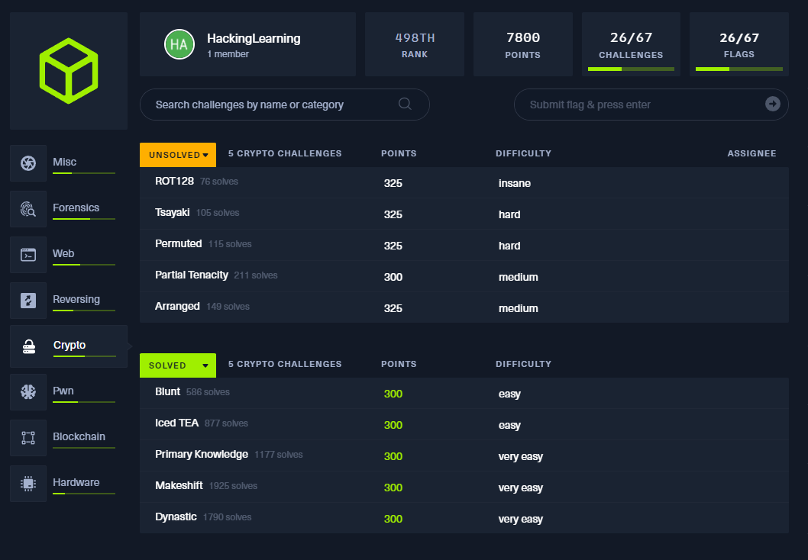
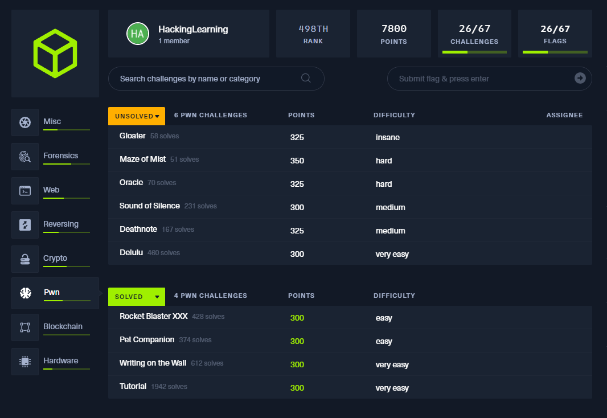
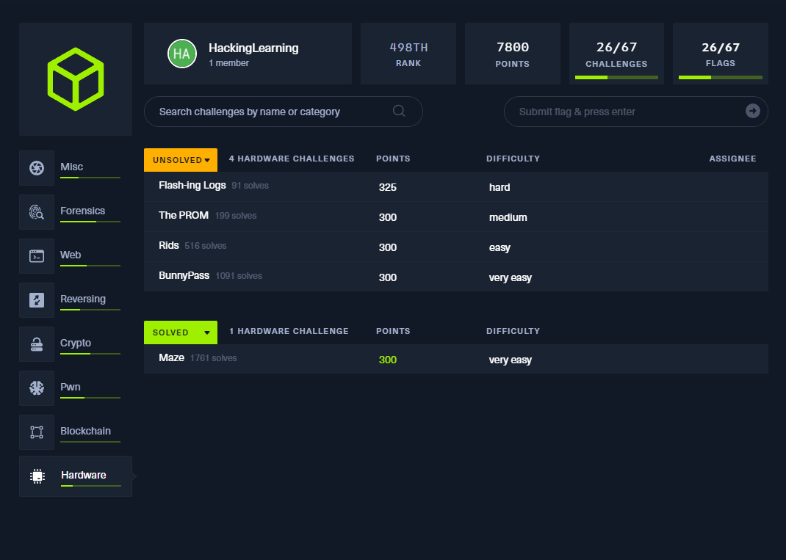

# Cyber Apocalypse CTF 2024 -  Writeup
 
[Learning Hacking Team](https://ctf.hackthebox.com/team/overview/163443)

## My Team Score:

## 1. Misc

## 2. Forensic

### 2.1. Very Easy
[Very Easy](https://github.com/DoNCCong/Cyber-Apocalypse-CTF-2024/tree/9ab7bd49df174b1e0f9c9368f6efbb6c9c3761b9/2.%20Forensics/1.%20Very%20Easy)

[Easy](https://github.com/DoNCCong/Cyber-Apocalypse-CTF-2024/tree/c5e1b9dd2cbe494166640c96f2d23cb6b3b5d0d2/2.%20Forensics/2.%20Easy)

[Medium]

## 3. Web

[Very Easy](https://github.com/DoNCCong/Cyber-Apocalypse-CTF-2024/tree/4cd8cddf14ee27f3907fe9c9986135d85113bf1d/3.%20Web/1.%20Very%20Easy)

[Easy](https://github.com/DoNCCong/Cyber-Apocalypse-CTF-2024/tree/4cd8cddf14ee27f3907fe9c9986135d85113bf1d/3.%20Web/2.%20Easy)

## 4. Reversing

## 5. Crypto

## 6. pwn

## 7. Hardware

[Very Easy](https://github.com/DoNCCong/Cyber-Apocalypse-CTF-2024/tree/e35f9f0d3a3cc1238f93cc0c62bde0ff9d103cab/7.%20Hardware)
